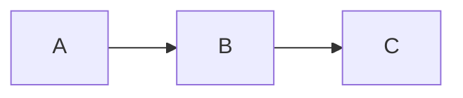

# Architecture: [Project or Solution Name]

**Date:** YYYY-MM-DD  
**Architect role output.** Use Manager brief + Research findings as input.

---

## Overview

- **Purpose:** What the system/solution does and for whom.
- **Scope (in):** What is in scope.
- **Scope (out):** What is explicitly out of scope or deferred.

---

## Components

| Component | Responsibility | Interfaces / boundaries |
|-----------|----------------|--------------------------|
| Component A | … | … |
| Component B | … | … |

*(Or use a short paragraph per component.)*

---

## Data / process flow

Describe how data or requests move through the system (or how the process runs).

- Step 1 → Step 2 → …
- Optional: Mermaid or diagram description below.

---

## Design decisions

| ID | Decision | Options considered | Chosen | Rationale |
|----|----------|--------------------|--------|-----------|
| 1 | … | … | … | … |
| 2 | … | … | … | … |

---

## Trade-offs and risks

- **Trade-offs:** (e.g. simplicity vs flexibility, speed vs cost)
- **Risks:** (technical, operational, organizational) + mitigation or acceptance

---

*Template: `templates/architecture.md`*
