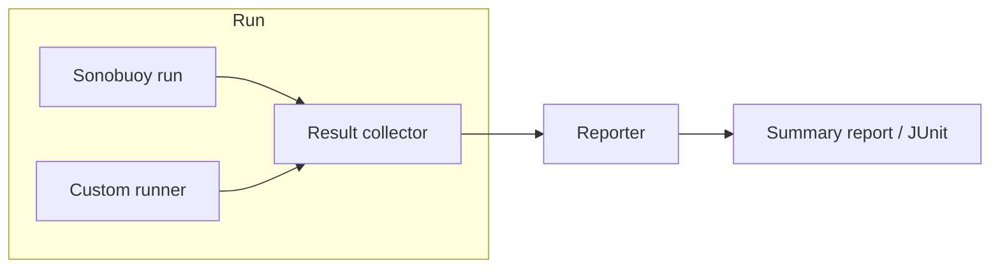

# Architecture: Kubernetes Cluster Acceptance Test (CAT) 프레임워크

**Project:** example-kubernetes-cat  
**Role:** Architect  
**Input:** `01-manager/project-brief.md`, `02-research/research-notes.md`  
**Date:** 2025-03

---

## Overview

### Purpose

Kubernetes 클러스터가 프로덕션으로 승격되기 전에 **구성·기능이 기대대로 동작하는지** 검증하기 위한 Cluster Acceptance Test(CAT) 프레임워크를 정의한다. 플랫폼/SRE 엔지니어가 테스트를 정의·실행하고, 결과를 수집·리포팅할 수 있는 개념 구조와 실행 모델을 제공한다.

### Scope (in)

- 테스트 **카테고리** 정의(API, 노드, DNS, 스토리지, 선택적 보안 등).
- **실행 모델**: 누가, 어디서, 어떤 순서로 테스트를 실행하는지.
- **결과 수집**: 어디서 결과가 생성·수집·저장되는지.
- **리포팅 모델**: 결과를 어떤 형식·위치로 산출하는지.
- 기존 도구(Sonobuoy 등)와의 **통합 방식** (기반 도구 + 선택적 커스텀 레이어).

### Scope (out)

- 실제 코드 구현, 클러스터 프로비저닝/배포, CI/CD 파이프라인 상세 설계. 표준 Kubernetes 1.24+ 가정; proprietary 확장 제외.

---

## Test categories (테스트 카테고리)

프레임워크에서 다루는 검증 항목을 카테고리로 구분한다. 각 카테고리는 “무엇을 검증하는지”와 “어떤 도구/방식으로 수행할지”만 정의하며, 구체적 테스트 케이스 나열은 Engineer 단계에서 다룬다.

| 카테고리 | 검증 목적 | 권장 수행 방식 (Research 정렬) |
|----------|-----------|----------------------------------|
| **Conformance** | Kubernetes API·핵심 동작이 표준 준수 여부 | Sonobuoy (Quick / Conformance / Certified-conformance 모드) |
| **API & Control plane** | API server 가용성, 인증/인가, 기본 리소스 CRUD | Sonobuoy e2e 일부 + 필요 시 kubectl 기반 스크립트 |
| **Nodes & Scheduling** | 노드 준비 상태(Ready), 스케줄링, 리소스 | Sonobuoy e2e + 선택적 스크립트(노드 조건 체크) |
| **DNS & Network** | CoreDNS/kube-dns 동작, 서비스 디스커버리, 기본 네트워크 | Sonobuoy 또는 커스텀 Job/Pod(예: nslookup, curl) |
| **Storage** | PVC/PV 바인딩, StorageClass 존재·동작 | Sonobuoy e2e + 팀 정의 StorageClass 검증(스크립트/KUTTL) |
| **Custom / Team** | 팀 정책, 특정 CRD, 내부 요구사항 | 스크립트, KUTTL 시나리오, 또는 Sonobuoy 플러그인 |

- **Conformance**는 공식 `[Conformance]` 스위트로 일원화하고, **Custom / Team**은 팀이 정의한 체크리스트를 스크립트 또는 KUTTL로 구현하는 것이 Research 권장과 일치한다.

---

## Components (구성 요소)

프레임워크는 “도구 + 실행·수집·리포팅 규칙”으로 구성되며, 물리적 단일 서비스보다는 **논리 컴포넌트**로 정의한다.

| Component | Responsibility | Interfaces / boundaries |
|-----------|----------------|---------------------------|
| **Conformance runner** | 공식 conformance(e2e) 테스트 실행 및 원시 결과 생성 | Sonobuoy(또는 Hydrophone) CLI; 입력: 클러스터 kubeconfig, 모드(quick/conformance/certified-conformance); 출력: tarball, JUnit XML, 로그 |
| **Custom test runner** | 팀 정의 acceptance(StorageClass, DNS, 정책 등) 실행 | 스크립트 또는 KUTTL; 입력: 클러스터 접근, 테스트 정의(YAML/스크립트); 출력: exit code, stdout/stderr, 선택적 파일 |
| **Result collector** | Conformance runner·Custom runner 산출물을 한 곳으로 모음 | 로컬 또는 공유 스토리지 경로; 입력: Sonobuoy tarball, 커스텀 실행 로그/파일; 출력: 단일 디렉터리(또는 아카이브) |
| **Reporter** | 수집된 결과를 사람·다운스트림이 쓸 수 있는 형태로 변환 | 입력: 수집된 결과; 출력: 요약 리포트(Markdown/HTML), JUnit XML(선택), 상태(pass/fail) |

- **Boundary:** Conformance runner는 Sonobuoy(권장) 또는 Hydrophone으로 구현 가능. Custom test runner는 팀이 선택한 스크립트/KUTTL/Job 정의로 구현. Result collector와 Reporter는 구현 시 “스크립트 + 디렉터리 규칙” 또는 소규모 래퍼로 둘 수 있으며, 상세는 Engineer 단계에서 정의.

---

## Data / process flow (실행·데이터 흐름)

1. **준비:** 대상 클러스터 kubeconfig, Sonobuoy(또는 대안) 설치, 커스텀 테스트 정의(스크립트/KUTTL 등) 준비.
2. **Conformance 실행:** Sonobuoy run(선택 모드) → wait → retrieve; 결과 tarball을 지정 디렉터리(Result collector 입력 위치)에 둠.
3. **Custom 실행:** 팀 정의 테스트를 스크립트 또는 KUTTL로 실행; 출력·로그를 동일하게 Result collector 입력 위치에 둠.
4. **수집:** Result collector가 위 두 경로(또는 규약된 경로)를 한 디렉터리/아카이브로 정리.
5. **리포팅:** Reporter가 수집 결과를 읽어 요약 리포트(pass/fail, 실패 항목, 링크) 생성; 필요 시 JUnit XML 유지.
6. **소비:** 플랫폼/SRE가 리포트와 원시 결과를 보고 “프로덕션 승격 여부” 또는 “재검증 대상” 판단.

- 실행 순서: Conformance 먼저 실행 후 Custom을 돌리거나, 병렬로 돌릴 수 있음(구현 시 선택). 전체 통과 여부는 Conformance + Custom 모두 성공일 때 pass로 정의하는 것을 권장.

---

## Execution model (실행 모델)

- **Who:** 플랫폼/SRE 엔지니어(또는 CI 서비스 계정)가 로컬 또는 CI 환경에서 Sonobuoy CLI 및 커스텀 runner를 실행.
- **Where:** Sonobuoy는 클러스터 내부에 테스트 Pod를 띄워 실행; 커스텀 테스트는 동일 클러스터 대상으로 로컬/CI에서 kubectl·스크립트/KUTTL 실행.
- **When:** 프로덕션 승격 전, 또는 정기 검증(예: 주간). Quick 모드는 수 분, 전체 conformance는 1–2시간 수준이므로 “빠른 게이트”에는 Quick + 커스텀 일부만 사용하는 구성을 허용.
- **Orchestration:** 단일 “CAT run”을 하나의 스크립트 또는 작은 runbook으로 묶어, Sonobuoy 단계 → 커스텀 단계 → 수집 → 리포팅 순서를 고정한다. 상세 단계는 Engineer의 runbook에서 정의.

---

## Result collection (결과 수집)

- **Conformance:** Sonobuoy `retrieve`로 받은 tarball을 지정 디렉터리(예: `./results/sonobuoy/<run-id>/`)에 저장. 내부에 JUnit XML, e2e.log 등이 포함됨.
- **Custom:** 스크립트/KUTTL 실행 시 출력 디렉터리를 규약(예: `./results/custom/<timestamp>/`)하고, 로그·exit code·필요 시 작은 결과 파일을 같은 규약으로 저장.
- **Collector:** 두 경로를 그대로 두거나, 하나의 `./results/cat/<run-id>/` 아래에 sonobuoy/, custom/ 서브디렉터리로 복사·이동하여 “한 run”당 한 디렉터리 트리로 정리. 보관 정책(보관 기간, 아카이브)은 운영 정책으로 별도 정의.

---

## Reporting model (리포팅 모델)

- **산출물:** (1) **요약 리포트**: Markdown 또는 HTML. 카테고리별 pass/fail, 실패한 테스트/체크 목록, Sonobuoy 결과 링크 또는 경로. (2) **원시 결과**: JUnit XML( Sonobuoy 기본), 커스텀 실행 로그. (3) **전체 통과 여부**: Conformance + Custom 모두 성공 시에만 “CAT passed”.
- **위치:** 리포트 파일은 Result collector가 정리한 디렉터리 내(예: `./results/cat/<run-id>/report.md`) 또는 팀이 정한 아티팩트 저장소에 저장. 원시 결과는 동일 run 디렉터리에 유지.
- **소비:** 사람이 report.md(및 로그)를 보고 판단; 필요 시 CI에서 JUnit 또는 exit code로 게이트(Engineer 단계에서 구체화).

---

## Integration with existing tools (기존 도구 통합)

- **Sonobuoy (핵심):** Conformance 카테고리 전담. `sonobuoy run --mode quick|conformance|certified-conformance`로 실행하고, `retrieve`한 tarball을 Result collector 경로에 두면 된다. 플러그인으로 추가 테스트를 Sonobuoy에 넣을 수 있으나, 간단한 팀 체크는 별도 스크립트/KUTTL이 유지보수에 유리하다는 Research 권장을 따름.
- **Hydrophone:** Sonobuoy 대신 경량 conformance만 필요할 때 대체 옵션. 실행·출력 경로만 동일한 “Conformance runner” 계약에 맞추면 Reporter는 동일하게 동작하도록 설계 가능.
- **KUTTL / 스크립트:** Custom / Team 카테고리 구현. KUTTL은 YAML로 시나리오를 두고, 스크립트는 kubectl + 간단한 검증 로직. 둘 다 “실행 → exit code + 로그/파일을 규약 경로에 저장”만 지키면 Reporter가 수집·요약할 수 있음.
- **kubectl-validate:** CAT 프레임워크의 “실행 시 검증” 전에, 매니페스트/Helm 렌더 결과를 검증하는 **선택적 사전 단계**로 둘 수 있음. 결과 수집/리포팅 경로와는 별도로 “배포 전 검증” 단계에서만 사용해도 됨.

---

## Design decisions

| ID | Decision | Options considered | Chosen | Rationale |
|----|----------|--------------------|--------|-----------|
| 1 | Conformance 수행 도구 | Sonobuoy vs Hydrophone vs 직접 e2e | Sonobuoy 기반 | Research 권장; 표준 스위트·리포팅·플러그인 확장을 한 번에 활용. Hydrophone은 경량 대안으로 옵션 유지. |
| 2 | 팀 정의 테스트 구현 방식 | Sonobuoy 플러그인만 vs 스크립트/KUTTL vs 둘 다 | Sonobuoy + 별도 스크립트/KUTTL | Research 하이브리드 권장; conformance는 Sonobuoy, 팀 체크는 단순 스크립트/KUTTL로 유지보수 부담 감소. |
| 3 | 결과 저장 위치 | 클러스터 내만 vs 로컬/CI만 vs 둘 다 | 로컬/CI 쪽 단일 디렉터리(규약) | Sonobuoy retrieve가 로컬 tarball이므로, 커스텀 결과도 로컬 규약 디렉터리로 통일하면 수집·리포팅이 단순함. |
| 4 | 전체 pass 기준 | Conformance만 vs Custom만 vs 둘 다 | Conformance + Custom 모두 성공 | “프로덕션 전 검증” 목표에 맞게, 표준 conformance와 팀 요구사항을 모두 만족해야 pass로 정의. |
| 5 | 리포팅 형식 | JUnit만 vs 요약 문서만 vs 둘 다 | 요약 리포트(Markdown/HTML) + JUnit 유지 | 사람 가독성(요약)과 CI/도구 연동(JUnit)을 동시에 만족. |

---

## Trade-offs and risks

### Trade-offs

- **표준 준수 vs 팀 유연성:** Sonobuoy로 표준을 맞추고, 커스텀 레이어를 최소로 두면 표준 준수는 좋아지지만 팀별 “꼭 필요한” 체크는 스크립트/KUTTL로 따로 관리해야 함. 프레임워크는 이 하이브리드를 전제로 설계함.
- **실행 시간 vs 커버리지:** Quick 모드는 빠르지만 전체 conformance보다 검증 범위가 작음. “빠른 게이트 + 주기적 전체 run” 같은 정책은 운영 단에서 정하고, 프레임워크는 두 모드(Quick / full)를 모두 지원하는 구조로 둠.
- **단일 도구 vs 다중 도구:** Sonobuoy만 쓰면 단순하지만 팀 체크가 복잡해질수록 플러그인 개발 부담이 커짐. 스크립트/KUTTL을 별도로 두면 도구가 늘어나지만 팀이 테스트를 빠르게 추가·변경하기 쉬움.

### Risks

- **Sonobuoy 버전·Kubernetes 버전 호환:** Sonobuoy와 클러스터 버전 불일치 시 테스트 실패 가능. 완화: 사용할 Sonobuoy·Kubernetes 버전을 문서에 명시하고, Engineer runbook에 버전 체크 단계 포함.
- **커스텀 테스트 품질:** 스크립트/KUTTL 테스트가 불안정하거나 리소스 정리 미흡 시 클러스터에 잔류 리소스·노이즈 발생. 완화: 테스트는 네임스페이스 격리·정리 단계를 runbook에 포함; Reviewer가 runbook 검토 시 확인.
- **결과 보관·용량:** Sonobuoy tarball과 로그가 쌓이면 디스크 사용량 증가. 완화: 보관 기간·아카이브 정책을 운영 가이드에 두고, Result collector 단계에서 정리 스크립트 권장.

---

*Architect 역할 산출물. 구현 상세는 Engineer 단계에서 진행.*
